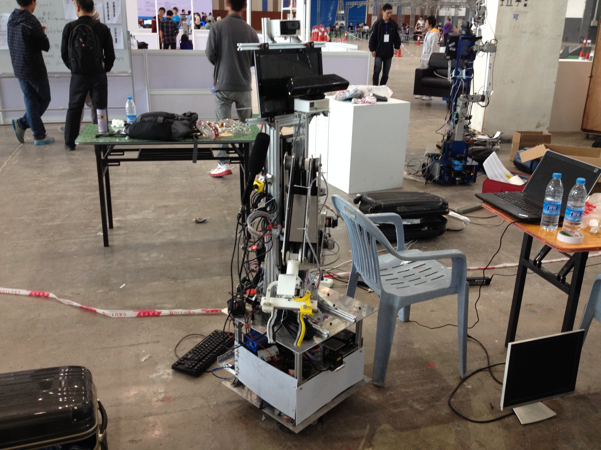
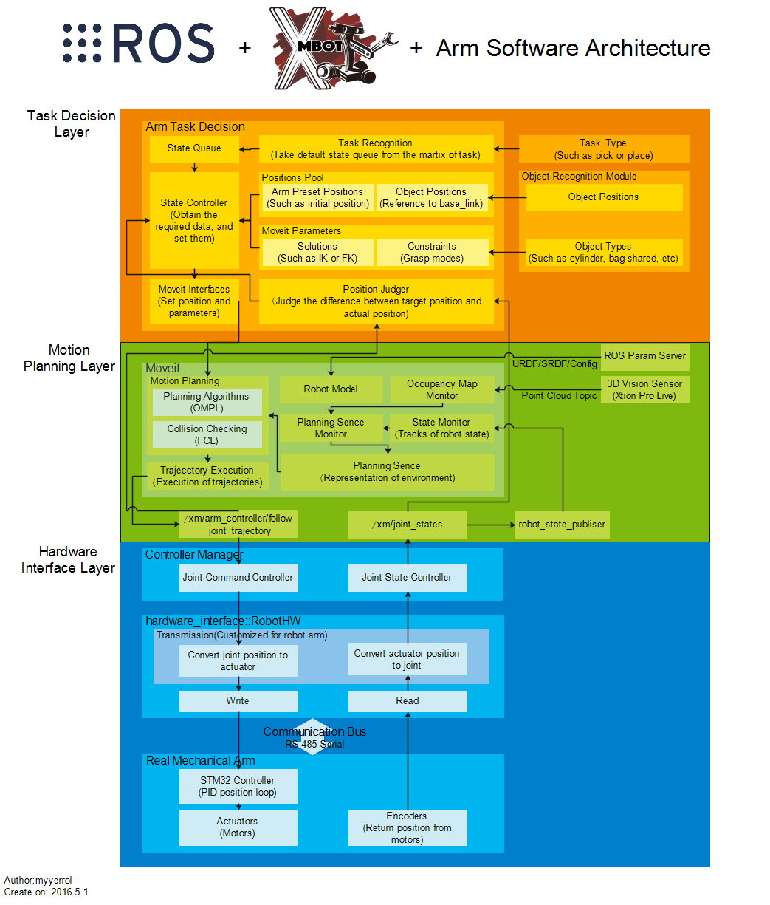
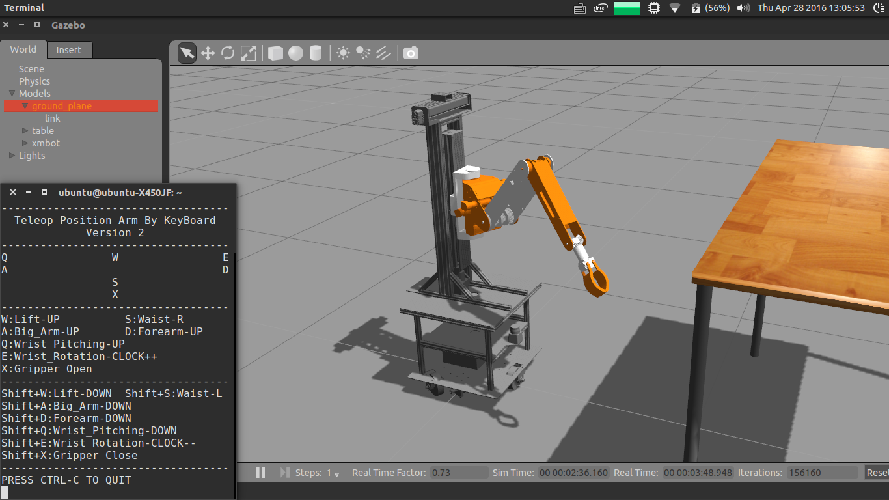
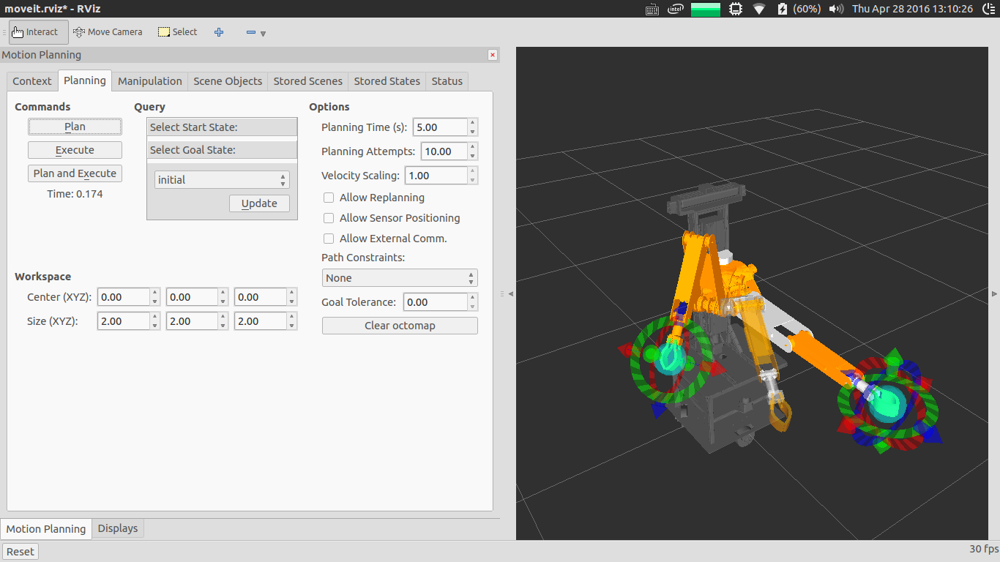
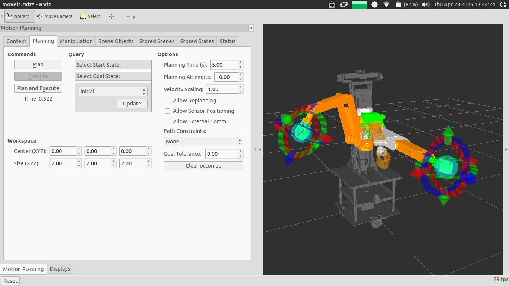
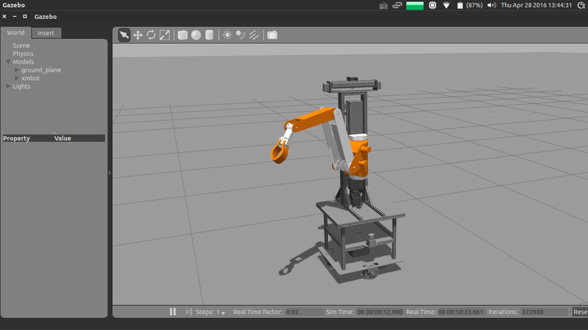
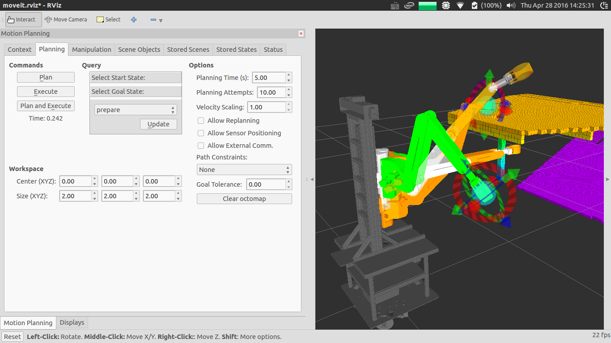

# xm_arm_workspace



## 1. Introduction

This ros metapackage builds the simple framework for the second generation of xmbot's manipulator, which includes the underlying driver, motion control, motion planning and motion simulation codes. About more code datails for xm-project, please visit following website: https://www.github.com/xm-project.


### 1.1 Hardware Driver

- **xm_arm_robot_hardware:** The xm_arm_robot_hardware package implements hardware interface by using ros_control.
- **xm_arm_hardware_serial_node:** The xm_arm_hardware_serial_node package provides serial communication between ros and embedded.
- **xm_arm_hardware_controller_config:** The xm_arm_hardware_controller_config package provides controller configuration files for controling the arm.

### 1.2 Motion Simulation

- **xm_arm_gazebo:** The xm_arm_gazebo package can launch xmbot in gazebo simulator.
- **xm_arm_gazebo_controller_config:** The xm_arm_gazebo_controller_config package provides controller configuration files for simulating in gazebo.

### 1.3 Motion Control

- **xm_arm_teleop:** The xm_arm_teleop package can control arm by using keyboard.
- **xm_arm_gripper_control:** The xm_arm_gripper_control package can control gripper.
- **xm_arm_trajectory_control:** The xm_arm_trajectory_control package can control joint trajectory.
- **xm_arm_dynamixel_control:** The xm_arm_dynamixel_control package can launch and control dynamixel servos.

### 1.4 Motion Planning

- **xm_arm_moveit_config:** An automatically generated package with all the configuration and launch files for using the xmbot with the MoveIt Motion Planning Framework.
- **xm_arm_moveit_control:** The xm_arm_moveit_control package provides motion planning by using forward or inverse kinematics.

### 1.5 Basic Components

- **xm_arm_msgs:** The xm_arm_msgs package provides messages, services and actions.
- **xm_arm_bringup:** The xm_arm_bringup package provides roslaunch for starting xmbot's arm motion planning and simulation test.
- **xm_arm_description:** The xm_arm_description package provides a complete 3D model of the xmbot for simulation and visualization. The files in this package are parsed and used by a variety of other components.

## 2. Installation

```bash
$> roscd
$> cd ../src
$> git clone https://github.com/myyerrol/xm_arm_workspace.git
$> cd ..
$> rosdep install -y --from-paths src --ignore-src --rosdistro indigo
$> catkin_make
```

## 3. Usage

### 3.1 Motion control

```bash
$> roslaunch xm_arm_bringup xm_arm_bringup_gazebo_joint_control.launch
$> rosrun xm_arm_teleop xm_arm_teleop_position_keyboard
```


### 3.2 Motion planning

```bash
$> roslaunch xm_arm_moveit demo.launch
```

```bash
$> roslaunch xm_arm_bringup xm_arm_bringup_moveit_and_gazebo.launch
```



### 3.3 Avoide collision

```bash
$> roslaunch xm_arm_bringup xm_arm_bringup_moveit_and_gazebo.launch
```



## 4. Summary

- According to the new mechanical arm software architecture, I rewrited the entire bottom-level driver codes of the xmbot's mechanical arm and add more features, such as motion planning, motion simulation.
- Because of the limited time, I have only finished the simple framework for the second generation of xmbot's manipulator. I haven't fully done some modules in architecture, such as motion planning, obstacle avoidance, v-rep simulation and encapsulation for module.
- For future planning, I will hope that new team members can gradually complete the final mechanical arm software architecture and improve the arm manipulation test better and better. For myself, I will need to improve my theory and programming ability, If there is a chance, then I will continue to do same research on the mechanical arm, until that time, I believe I must do better than now!
